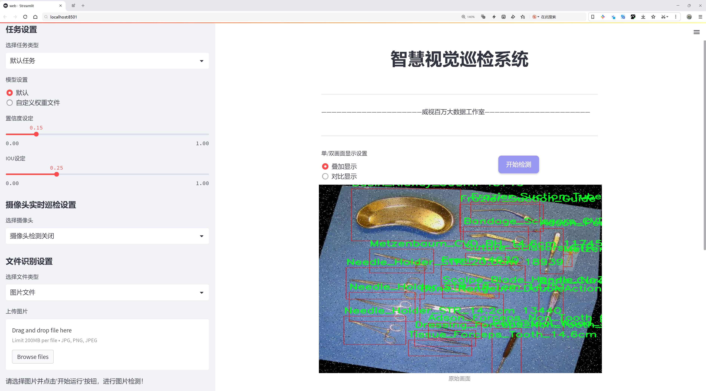
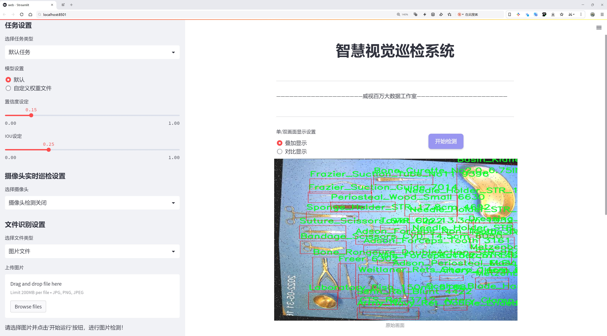
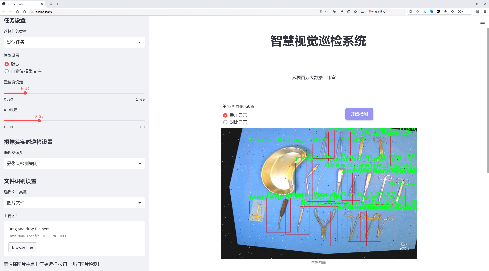
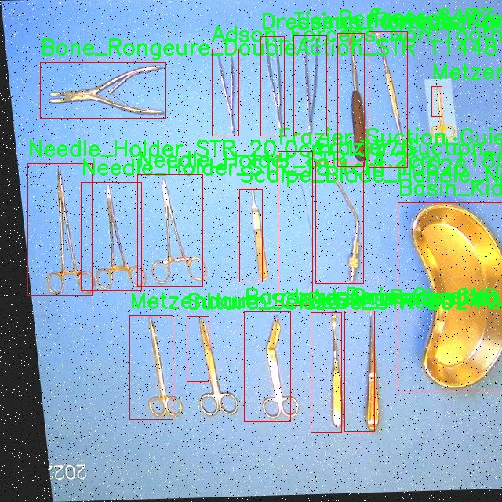
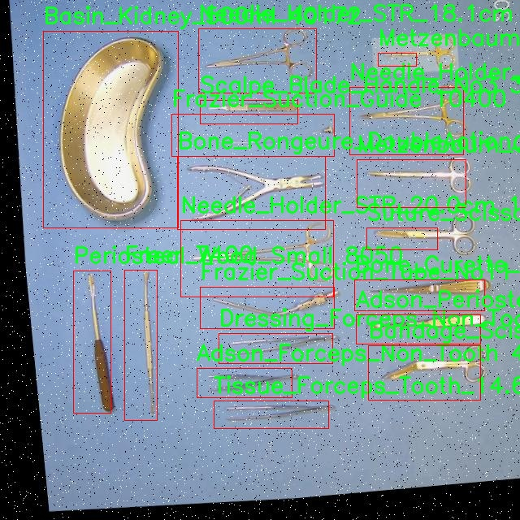
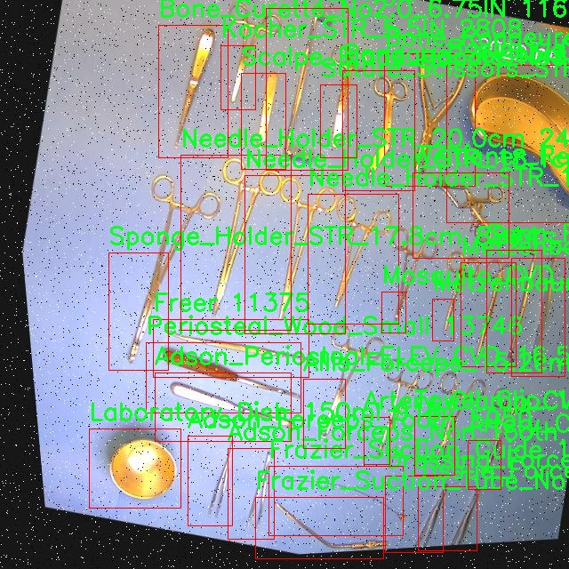
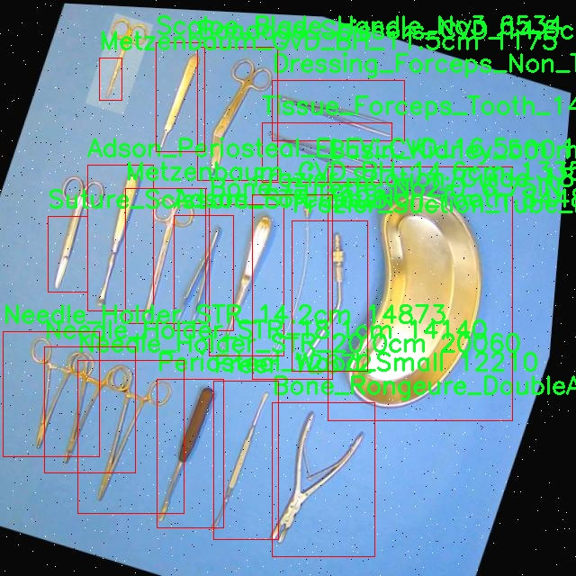
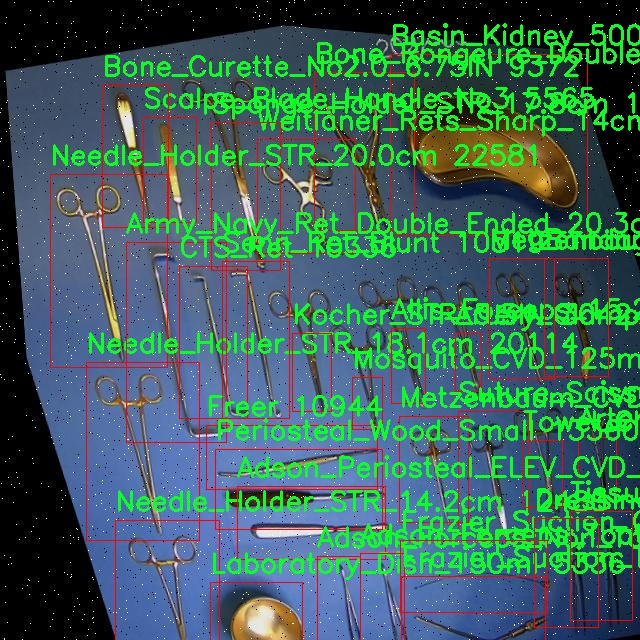

# 手术器械检测系统源码分享
 # [一条龙教学YOLOV8标注好的数据集一键训练_70+全套改进创新点发刊_Web前端展示]

### 1.研究背景与意义

项目参考[AAAI Association for the Advancement of Artificial Intelligence](https://gitee.com/qunmasj/projects)

项目来源[AACV Association for the Advancement of Computer Vision](https://kdocs.cn/l/cszuIiCKVNis)

研究背景与意义

随着医学技术的不断进步，手术器械的种类和数量日益增加，手术过程中的器械管理与监控变得愈发复杂。手术器械的精准识别与分类对于提高手术效率、降低医疗差错具有重要意义。传统的手术器械管理方式往往依赖于人工识别和分类，存在着效率低、易出错等问题。因此，开发一种高效、准确的手术器械检测系统显得尤为必要。

近年来，深度学习技术的迅猛发展为物体检测领域带来了新的机遇。YOLO（You Only Look Once）系列模型因其高效的实时检测能力和较高的准确率，逐渐成为物体检测任务中的重要工具。YOLOv8作为该系列的最新版本，结合了多种先进的技术，能够在保证检测精度的同时，实现更快的推理速度。然而，尽管YOLOv8在一般物体检测任务中表现出色，但在特定领域，如手术器械检测中，仍然面临着一些挑战。

本研究旨在基于改进的YOLOv8模型，构建一个高效的手术器械检测系统。为此，我们将利用BHQ_OFA2数据集，该数据集包含49张图像和32个类别的手术器械，涵盖了从基本的剪刀、钳子到复杂的吸引器等多种器械。这些器械在手术过程中扮演着不同的角色，准确的识别和分类不仅有助于手术团队快速找到所需器械，还能在手术结束后进行有效的器械清点，降低器械遗留在体内的风险。

通过对YOLOv8模型的改进，我们将针对手术器械的特性进行优化，例如通过增强数据集、调整模型结构和训练策略，以提高模型在特定任务中的表现。我们将探索如何通过引入新的损失函数、改进特征提取层以及优化模型的超参数，来提升检测精度和速度。此外，研究还将关注模型在不同手术环境下的适应性，以确保其在实际应用中的有效性。

本研究的意义不仅在于提升手术器械的检测精度和效率，更在于推动医疗智能化的发展。通过将深度学习技术应用于手术器械管理，能够为医疗机构提供更加智能化的解决方案，减少人工干预，提高手术安全性。同时，该研究也为其他领域的物体检测提供了借鉴，推动了深度学习技术在医疗行业的应用。

综上所述，基于改进YOLOv8的手术器械检测系统的研究，既是对当前医疗器械管理现状的回应，也是对深度学习技术应用于医疗领域的探索。通过本研究，我们希望能够为手术器械的智能化管理提供有效的技术支持，为提升医疗服务质量贡献一份力量。

### 2.图片演示







##### 注意：由于此博客编辑较早，上面“2.图片演示”和“3.视频演示”展示的系统图片或者视频可能为老版本，新版本在老版本的基础上升级如下：（实际效果以升级的新版本为准）

  （1）适配了YOLOV8的“目标检测”模型和“实例分割”模型，通过加载相应的权重（.pt）文件即可自适应加载模型。

  （2）支持“图片识别”、“视频识别”、“摄像头实时识别”三种识别模式。

  （3）支持“图片识别”、“视频识别”、“摄像头实时识别”三种识别结果保存导出，解决手动导出（容易卡顿出现爆内存）存在的问题，识别完自动保存结果并导出到tempDir中。

  （4）支持Web前端系统中的标题、背景图等自定义修改，后面提供修改教程。

  另外本项目提供训练的数据集和训练教程,暂不提供权重文件（best.pt）,需要您按照教程进行训练后实现图片演示和Web前端界面演示的效果。

### 3.视频演示

[3.1 视频演示](https://www.bilibili.com/video/BV1wy1yYDEsh/)

### 4.数据集信息展示

##### 4.1 本项目数据集详细数据（类别数＆类别名）

nc: 32
names: ['Adson_Forceps_Non_Tooth', 'Adson_Forceps_Tooth', 'Adson_Periosteal_ELEV_CVD_16.5cm', 'Allis_Forceps_15.2cm', 'Army_Navy_Ret_Double_Ended_20.3cm', 'Artery_Clamp_CVD_140mm', 'Artery_Clamp_STR', 'Bandage_Scissors_CVD_14.5cm', 'Basin_Kidney_500ml', 'Bone_Curette_No2.0_6.75IN', 'Bone_Rongeure_DoubleAction_STR', 'CTS_Ret', 'Dressing_Forceps_Non_Tooth_14cm', 'Frazier_Suction_Guide', 'Frazier_Suction_Tube_No11', 'Freer', 'Kocher_STR_5.5IN', 'Laboratory_Dish_150ml', 'Metzenbaum_CVD_BH_11.5cm', 'Metzenbaum_CVD_BH_14.6cm', 'Mosquito_CVD_125mm', 'Needle_Holder_STR_14.2cm', 'Needle_Holder_STR_18.1cm', 'Needle_Holder_STR_20.0cm', 'Periosteal_Wood_Small', 'Scalpe_Blade_Handle_No3', 'Senn_Ret_Blunt', 'Sponge_Holder_STR_17.8cm', 'Suture_Scissors_STR', 'Tissue_Forceps_Tooth_14.6cm', 'Towel_Clip_13.3cm', 'Weitlaner_Rets_Sharp_14cm']


##### 4.2 本项目数据集信息介绍

数据集信息展示

在手术器械检测系统的研究中，数据集的选择与构建至关重要。本研究采用的数据集名为“BHQ_OFA2”，其设计旨在为改进YOLOv8模型提供高质量的训练数据，以实现更精准的手术器械识别与分类。该数据集包含32个类别的手术器械，涵盖了广泛的外科手术工具，能够为模型的训练提供丰富的样本和多样化的特征信息。

具体而言，数据集中包括了多种类型的手术器械，如“Adson_Forceps_Non_Tooth”和“Adson_Forceps_Tooth”，这两种器械的设计差异使得模型在识别时需要关注其细微的外观特征。此外，数据集中还包含了如“Allis_Forceps_15.2cm”和“Army_Navy_Ret_Double_Ended_20.3cm”等经典的外科器械，这些器械在实际手术中应用广泛，其识别的准确性直接影响到手术的安全性和效率。

在数据集的构建过程中，研究团队特别注重器械的多样性与代表性。例如，“Artery_Clamp_CVD_140mm”和“Artery_Clamp_STR”这两种动脉夹的存在，能够帮助模型学习到不同设计和用途的器械之间的区别。而“Bandage_Scissors_CVD_14.5cm”与“Bone_Rongeure_DoubleAction_STR”等器械的引入，则进一步丰富了数据集的内容，使得模型在面对不同手术场景时能够具备更强的适应能力。

此外，数据集中还包括了一些特定用途的器械，如“Frazier_Suction_Guide”和“Frazier_Suction_Tube_No11”，这些器械在手术中扮演着重要的角色，能够帮助医生在复杂的手术环境中进行有效的操作。通过对这些器械的识别，模型不仅能够提高对手术器械的整体理解，还能在实际应用中为医生提供实时的辅助信息。

在训练过程中，数据集的多样性和丰富性使得YOLOv8模型能够学习到不同器械的特征，从而提高其检测精度。比如，“Needle_Holder_STR_14.2cm”和“Needle_Holder_STR_20.0cm”这两种不同尺寸的针持器，虽然功能相似，但在外观上却存在明显差异，模型需要通过训练来掌握这些细微的差别，以便在实际应用中做出准确的判断。

最后，数据集“BHQ_OFA2”的构建不仅考虑了器械的种类和功能，还注重了器械在手术中的实际应用场景。这种全面的设计理念为手术器械检测系统的开发奠定了坚实的基础，使得模型在面对真实手术环境时能够表现出更高的鲁棒性和准确性。通过对该数据集的深入分析与应用，研究团队期望能够推动手术器械自动识别技术的发展，为未来的智能医疗提供有力支持。











### 5.全套项目环境部署视频教程（零基础手把手教学）

[5.1 环境部署教程链接（零基础手把手教学）](https://www.ixigua.com/7404473917358506534?logTag=c807d0cbc21c0ef59de5)


[5.2 安装Python虚拟环境创建和依赖库安装视频教程链接（零基础手把手教学）](https://www.ixigua.com/7404474678003106304?logTag=1f1041108cd1f708b01a)

### 6.手把手YOLOV8训练视频教程（零基础小白有手就能学会）

[6.1 手把手YOLOV8训练视频教程（零基础小白有手就能学会）](https://www.ixigua.com/7404477157818401292?logTag=d31a2dfd1983c9668658)


按照上面的训练视频教程链接加载项目提供的数据集，运行train.py即可开始训练



     Epoch   gpu_mem       box       obj       cls    labels  img_size
     1/200     20.8G   0.01576   0.01955  0.007536        22      1280: 100%|██████████| 849/849 [14:42<00:00,  1.04s/it]
               Class     Images     Labels          P          R     mAP@.5 mAP@.5:.95: 100%|██████████| 213/213 [01:14<00:00,  2.87it/s]
                 all       3395      17314      0.994      0.957      0.0957      0.0843

     Epoch   gpu_mem       box       obj       cls    labels  img_size
     2/200     20.8G   0.01578   0.01923  0.007006        22      1280: 100%|██████████| 849/849 [14:44<00:00,  1.04s/it]
               Class     Images     Labels          P          R     mAP@.5 mAP@.5:.95: 100%|██████████| 213/213 [01:12<00:00,  2.95it/s]
                 all       3395      17314      0.996      0.956      0.0957      0.0845

     Epoch   gpu_mem       box       obj       cls    labels  img_size
     3/200     20.8G   0.01561    0.0191  0.006895        27      1280: 100%|██████████| 849/849 [10:56<00:00,  1.29it/s]
               Class     Images     Labels          P          R     mAP@.5 mAP@.5:.95: 100%|███████   | 187/213 [00:52<00:00,  4.04it/s]
                 all       3395      17314      0.996      0.957      0.0957      0.0845


### 7.70+种全套YOLOV8创新点代码加载调参视频教程（一键加载写好的改进模型的配置文件）

[7.1 70+种全套YOLOV8创新点代码加载调参视频教程（一键加载写好的改进模型的配置文件）](https://www.ixigua.com/7404478314661806627?logTag=29066f8288e3f4eea3a4)

### 8.70+种全套YOLOV8创新点原理讲解（非科班也可以轻松写刊发刊，V10版本正在科研待更新）

#### 由于篇幅限制，每个创新点的具体原理讲解就不一一展开，具体见下列网址中的创新点对应子项目的技术原理博客网址【Blog】：


[8.1 70+种全套YOLOV8创新点原理讲解链接](https://gitee.com/qunmasj/good)

#### 部分改进原理讲解(完整的改进原理见上图和技术博客链接)
### YOLOv8简介

YOLOv8是一种最新的SOTA算法，提供了N/S/M/L/X尺度的不同大小模型，以满足不同场景的需求。本章对算法网络的新特性进行简要介绍。


1）骨干网络和Neck
开发者设计了C2f模块对CSPDarkNet 53和PAFPN进行改造。相比C3模块，C2f模块拥有更多的分支跨层链接，使模型的梯度流更加丰富，显著增强了模型的特征提取能力。
2)Head部分
Head部分采用无锚框设计，将分类任务和回归任务进行了解耦，独立的分支将更加专注于其所负责的特征信息。
3）损失计算
模型使用CIOU Loss作为误差损失函数，并通过最小化DFL进一步提升边界框的回归精度。同时模型采用了TaskAlignedAssigner样本分配策略，以分类得分和IOU的高阶组合作为指标指导正负样本选择，实现了高分类得分和高IOU的对齐，有效地提升了模型的检测精度。


### D-LKA Attention简介
自2010年代中期以来，卷积神经网络（CNNs）已成为许多计算机视觉应用的首选技术。它们能够从原始数据中自动提取复杂的特征表示，无需手动进行特征工程，这引起了医学图像分析社区的极大兴趣。许多成功的CNN架构，如U-Net、全卷积网络、DeepLab或SegCaps（分割胶囊），已经被开发出来。这些架构在语义分割任务中取得了巨大成功，先前的最新方法已经被超越。

在计算机视觉研究中，不同尺度下的目标识别是一个关键问题。在CNN中，可检测目标的大小与相应网络层的感受野尺寸密切相关。如果一个目标扩展到超出这个感受野的边界，这可能会导致欠分割结果。相反，与目标实际大小相比使用过大的感受野可能会限制识别，因为背景信息可能会对预测产生不必要的影响。

解决这个问题的一个有希望的方法涉及在并行使用具有不同尺寸的多个Kernel，类似于Inception块的机制。然而，由于参数和计算要求的指数增长，将Kernel大小增加以容纳更大的目标在实践中受到限制。因此，出现了各种策略，包括金字塔池化技术和不同尺度的扩张卷积，以捕获多尺度的上下文信息。

另一个直观的概念涉及将多尺度图像金字塔或它们的相关特征表示直接纳入网络架构。然而，这种方法存在挑战，特别是在管理训练和推理时间方面的可行性方面存在挑战。在这个背景下，使用编码器-解码器网络，如U-Net，已被证明是有利的。这样的网络在较浅的层中编码外观和位置，而在更深的层中，通过神经元的更广泛的感受野捕获更高的语义信息和上下文信息。

一些方法将来自不同层的特征组合在一起，或者预测来自不同尺寸的层的特征以使用多尺度的信息。此外，出现了从不同尺度的层中预测特征的方法，有效地实现了跨多个尺度的见解整合。然而，大多数编码器-解码器结构面临一个挑战：它们经常无法在不同尺度之间保持一致的特征，并主要使用最后一个解码器层生成分割结果。

语义分割是一项任务，涉及根据预定义的标签集为图像中的每个像素预测语义类别。这项任务要求提取高级特征同时保留初始的空间分辨率。CNNs非常适合捕获局部细节和低级信息，尽管以忽略全局上下文为代价。视觉Transformer（ViT）架构已经成为解决处理全局信息的视觉任务的关键，包括语义分割，取得了显著的成功。

ViT的基础是注意力机制，它有助于在整个输入序列上聚合信息。这种能力使网络能够合并远程的上下文提示，超越了CNN的有限感受野尺寸。然而，这种策略通常会限制ViT有效建模局部信息的能力。这种局限可能会妨碍它们检测局部纹理的能力，这对于各种诊断和预测任务至关重要。这种缺乏局部表示可以归因于ViT模型处理图像的特定方式。

ViT模型将图像分成一系列Patch，并使用自注意力机制来模拟它们之间的依赖关系。这种方法可能不如CNN模型中的卷积操作对感受野内提取局部特征有效。ViT和CNN模型之间的这种图像处理方法的差异可能解释了CNN模型在局部特征提取方面表现出色的原因。

近年来，已经开发出创新性方法来解决Transformer模型内部局部纹理不足的问题。其中一种方法是通过互补方法将CNN和ViT特征结合起来，以结合它们的优势并减轻局部表示的不足。TransUNet是这种方法的早期示例，它在CNN的瓶颈中集成了Transformer层，以模拟局部和全局依赖关系。HiFormer提出了一种解决方案，将Swin Transformer模块和基于CNN的编码器结合起来，生成两个多尺度特征表示，通过Double-Level Fusion模块集成。UNETR使用基于Transformer的编码器和CNN解码器进行3D医学图像分割。CoTr和TransBTS通过Transformer在低分辨率阶段增强分割性能，将CNN编码器和解码器连接在一起。

增强局部特征表示的另一种策略是重新设计纯Transformer模型内部的自注意力机制。在这方面，Swin-Unet在U形结构中集成了一个具有线性计算复杂性的Swin Transformer块作为多尺度 Backbone 。MISSFormer采用高效Transformer来解决视觉Transformer中的参数问题，通过在输入块上进行不可逆的降采样操作。D-Former引入了一个纯Transformer的管道，具有双重注意模块，以分段的方式捕获细粒度的局部注意和与多元单元的交互。然而，仍然存在一些特定的限制，包括计算效率低下，如TransUNet模型所示，对CNN Backbone 的严重依赖，如HiFormer所观察到的，以及对多尺度信息的忽略。

此外，目前的分割架构通常采用逐层处理3D输入 volumetric 的方法，无意中忽视了相邻切片之间的潜在相关性。这一疏忽限制了对 volumetric 信息的全面利用，因此损害了定位精度和上下文集成。此外，必须认识到，医学领域的病变通常在形状上发生变形。因此，用于医学图像分析的任何学习算法都必须具备捕捉和理解这些变形的能力。与此同时，该算法应保持计算效率，以便处理3D volumetric数据。

为了解决上述提到的挑战，作者提出了一个解决方案，即可变形大卷积核注意力模块（Deformable LKA module），它是作者网络设计的基本构建模块。这个模块明确设计成在有效处理上下文信息的同时保留局部描述符。作者的架构在这两个方面的平衡增强了实现精确语义分割的能力。

值得注意的是，参考该博客引入了一种基于数据的感受野的动态适应，不同于传统卷积操作中的固定滤波器Mask。这种自适应方法使作者能够克服与静态方法相关的固有限制。这种创新方法还扩展到了D-LKA Net架构的2D和3D版本的开发。

在3D模型的情况下，D-LKA机制被量身定制以适应3D环境，从而实现在不同 volumetric 切片之间无缝信息交互。最后，作者的贡献通过其计算效率得到进一步强调。作者通过仅依靠D-LKA概念的设计来实现这一点，在各种分割基准上取得了显著的性能，确立了作者的方法作为一种新的SOTA方法。

在本节中，作者首先概述方法论。首先，作者回顾了由Guo等人引入的大卷积核注意力（Large Kernel Attention，LKA）的概念。然后，作者介绍了作者对可变形LKA模块的创新探索。在此基础上，作者介绍了用于分割任务的2D和3D网络架构。

大卷积核提供了与自注意力机制类似的感受野。可以通过使用深度卷积、深度可扩展卷积和卷积来构建大卷积核，从而减少了参数和计算量。构建输入维度为和通道数的卷积核的深度卷积和深度可扩展卷积的卷积核大小的方程如下：


具有卷积核大小和膨胀率。参数数量和浮点运算（FLOPs）的计算如下：


FLOPs的数量与输入图像的大小成线性增长。参数的数量随通道数和卷积核大小的增加而呈二次增长。然而，由于它们通常都很小，因此它们不是限制因素。

为了最小化对于固定卷积核大小K的参数数量，可以将方程3对于膨胀率的导数设定为零：


例如，当卷积核大小为时，结果是。将这些公式扩展到3D情况是直接的。对于大小为和通道数C的输入，3D情况下参数数量和FLOPs 的方程如下：


具有卷积核大小和膨胀。


利用大卷积核进行医学图像分割的概念通过引入可变形卷积得以扩展。可变形卷积可以通过整数偏移自由调整采样网格以进行自由变形。额外的卷积层从特征图中学习出变形，从而创建一个偏移场。基于特征本身学习变形会导致自适应卷积核。这种灵活的卷积核形状可以提高病变或器官变形的表示，从而增强了目标边界的定义。

负责计算偏移的卷积层遵循其相应卷积层的卷积核大小和膨胀。双线性插值用于计算不在图像网格上的偏移的像素值。如图2所示，D-LKA模块可以表示为：


其中输入特征由表示，。表示为注意力图，其中每个值表示相应特征的相对重要性。运算符  表示逐元素乘法运算。值得注意的是，LKA不同于传统的注意力方法，它不需要额外的规范化函数，如或。这些规范化函数往往忽视高频信息，从而降低了基于自注意力的方法的性能。

在该方法的2D版本中，卷积层被可变形卷积所替代，因为可变形卷积能够改善对具有不规则形状和大小的目标的捕捉能力。这些目标在医学图像数据中常常出现，因此这种增强尤为重要。

然而，将可变形LKA的概念扩展到3D领域会带来一定的挑战。主要的约束来自于需要用于生成偏移的额外卷积层。与2D情况不同，由于输入和输出通道的性质，这一层无法以深度可分的方式执行。在3D环境中，输入通道对应于特征，而输出通道扩展到，其中是卷积核的大小。大卷积核的复杂性导致沿第3D的通道数扩展，导致参数和FLOPs大幅增加。因此，针对3D情况采用了另一种替代方法。在现有的LKA框架中，深度卷积之后引入了一个单独的可变形卷积层。这种战略性的设计调整旨在减轻扩展到3D领域所带来的挑战。


2D网络的架构如图1所示。第一变种使用MaxViT作为编码器组件，用于高效特征提取，而第二变种则结合可变形LKA层进行更精细、卓越的分割。

在更正式的描述中，编码器生成4个分层输出表示。首先，卷积干扰将输入图像的维度减小到。随后，通过4个MaxViT块的4个阶段进行特征提取，每个阶段后跟随降采样层。随着过程进展到解码器，实施了4个阶段的D-LKA层，每个阶段包含2个D-LKA块。然后，应用Patch扩展层以实现分辨率上采样，同时减小通道维度。最后，线性层负责生成最终的输出。

2D D-LKA块的结构包括LayerNorm、可变形LKA和多层感知器（MLP）。积分残差连接确保了有效的特征传播，即使在更深层也是如此。这个安排可以用数学方式表示为：


其中输入特征，层归一化LN，可变形LKA注意力，深度卷积，线性层和GeLU激活函数。

3D网络架构如图1所示，采用编码器-解码器设计进行分层结构化。首先，一个Patch嵌入层将输入图像的维度从（）减小到（）。在编码器中，采用了3个D-LKA阶段的序列，每个阶段包含3个D-LKA块。在每个阶段之后，通过降采样步骤将空间分辨率减半，同时将通道维度加倍。中央瓶颈包括另一组2个D-LKA块。解码器结构与编码器相对称。

为了将特征分辨率加倍，同时减少通道数，使用转置卷积。每个解码器阶段都使用3个D-LKA块来促进远距离特征依赖性。最终的分割输出由一个卷积层产生，后面跟随一个卷积层以匹配特定类别的通道要求。

为了建立输入图像和分割输出之间的直接连接，使用卷积形成了一个跳跃连接。额外的跳跃连接根据简单的加法对来自其他阶段的特征进行融合。最终的分割图是通过和卷积层的组合产生的。

3D D-LKA块包括层归一化，后跟D-LKA注意力，应用了残差连接的部分。随后的部分采用了一个卷积层，后面跟随一个卷积层，两者都伴随着残差连接。这个整个过程可以总结如下：


带有输入特征 、层归一化 、可变形 LKA 、卷积层 和输出特征 的公式。是指一个前馈网络，包括2个卷积层和激活函数。

表7显示了普通卷积和构建卷积的参数数量比较。尽管标准卷积的参数数量在通道数较多时急剧增加，但分解卷积的参数总体较低，并且增长速度不那么快。

与分解卷积相比，可变形分解卷积增加了大量参数，但仍然明显小于标准卷积。可变形卷积的主要参数是由偏移网络创建的。在这里，作者假设可变形深度卷积的Kernel大小为（5,5），可变形深度空洞卷积的Kernel大小为（7,7）。这导致了21×21大小的大Kernel的最佳参数数量。更高效地生成偏移量的方法将大大减少参数数量。


值得注意的是，引入可变形LKA确实会增加模型的参数数量和每秒的浮点运算次数（FLOPS）。然而，重要的是强调，这增加的计算负载不会影响作者模型的整体推理速度。

相反，对于Batch-size > 1，作者甚至观察到推理时间的减少，如图7所示。例如，基于作者的广泛实验，作者观察到对于Batch-size为16，具有可变形卷积和没有可变形卷积的推理时间分别为8.01毫秒和17.38毫秒。作者认为这是由于在2D中对可变形卷积的高效实现所致。为了测量时间，使用了大小为（）的随机输入。在GPU热身周期50次迭代之后，网络被推断了1000次。测量是在NVIDIA RTX 3090 GPU上进行的。


为了充分利用性能与参数之间的权衡关系，作者在图8中可视化了在Synapse 2D数据集上报告的DSC和HD性能以及基于参数数量的内存消耗。D-LKA Net引入了相当多的参数，约为101M。这比性能第二好的方法ScaleFormer使用的111.6M参数要少。

与更轻量级的DAEFormer模型相比，作者实现了更好的性能，这证明了参数增加的合理性。大多数参数来自于MaxViT编码器；因此，将编码器替换为更高效的编码器可以减少模型参数。值得注意的是，在此可视化中，作者最初将HD和内存值都归一化到[0, 100]范围内。随后，作者将它们从100缩小，以增强更高值的表示。


### 9.系统功能展示（检测对象为举例，实际内容以本项目数据集为准）

图9.1.系统支持检测结果表格显示

  图9.2.系统支持置信度和IOU阈值手动调节

  图9.3.系统支持自定义加载权重文件best.pt(需要你通过步骤5中训练获得)

  图9.4.系统支持摄像头实时识别

  图9.5.系统支持图片识别

  图9.6.系统支持视频识别

  图9.7.系统支持识别结果文件自动保存

  图9.8.系统支持Excel导出检测结果数据


### 10.原始YOLOV8算法原理

原始YOLOv8算法原理

YOLOv8是由Ultralytics公司于2023年1月10日推出的目标检测算法，它在YOLOv7的基础上进行了显著的优化与改进。作为YOLO系列的最新版本，YOLOv8不仅延续了前几代算法的核心思想，还引入了一系列新的技术和架构设计，使其在目标检测的精度和速度上都得到了大幅提升。YOLOv8的设计理念是将目标检测任务视为一个回归问题，通过一个单一的神经网络模型，直接从输入图像中预测目标的位置和类别。这种方法避免了传统目标检测算法中常用的滑动窗口或区域提议的复杂过程，从而显著提高了检测的效率。

在网络结构方面，YOLOv8的主干网络依然采用了CSP（Cross Stage Partial）结构，但进行了进一步的优化，主要是将C3模块替换为C2f模块。C2f模块通过引入更多的跳层连接，增强了梯度流的丰富性，进而提升了模型的学习能力。此外，YOLOv8在特征增强网络中采用了PAN-FPN（Path Aggregation Network - Feature Pyramid Network）的设计理念，这一结构能够有效地融合不同尺度的特征信息，使得模型在处理多尺度目标时表现得更加出色。

YOLOv8的检测头部分则引入了解耦头的概念，将分类和回归任务分为两个独立的分支。这种设计使得模型能够更加专注于各自的任务，从而在复杂场景下减少定位不准和分类错误的现象。通过解耦，YOLOv8能够在分类任务中更好地分析特征图中提取到的特征与已知类别之间的相似性，同时在定位任务中更加关注边界框与真实框之间的关系。这种任务对齐的策略，结合了分类分数和IOU（Intersection over Union）的高次幂乘积，进一步提升了模型的定位和分类精度。

YOLOv8的另一个显著特征是其采用了Anchor-free的目标检测方法。传统的目标检测算法通常依赖于预定义的锚点框来预测目标的位置，这种方法在选择和调整锚点框时往往比较繁琐，且对不同尺度和形状的目标的适应性较差。而YOLOv8通过回归方式直接预测目标的位置和大小，简化了模型的设计，使得网络能够更快地聚焦于目标的邻近区域，从而使得预测框更接近于实际的边界框。

在训练过程中，YOLOv8也进行了多项创新。为了提高模型的鲁棒性和泛化能力，YOLOv8在数据增强方面进行了优化，特别是在最后的训练阶段停止使用Mosaic数据增强，以避免对数据真实分布的破坏。这一策略确保了模型能够学习到更有效的特征，提升了检测的准确性。

从性能上来看，YOLOv8在精度和速度上都表现出了优越性。与YOLO系列的前几代模型相比，YOLOv8在mAP（mean Average Precision）和帧率上均有显著提升。例如，与SSD（Single Shot MultiBox Detector）算法相比，YOLOv8的精度提高了43.23%，帧率则提升了10.28倍。这使得YOLOv8在实时检测任务中表现得尤为出色，能够满足智能监控、自动驾驶和人脸识别等多种应用场景的需求。

YOLOv8的轻量化设计也是其一大亮点。相较于之前的YOLO系列模型，YOLOv8的权重文件进一步减小，使得其能够在各种嵌入式设备上高效运行。这一特性使得YOLOv8不仅适用于高性能计算环境，也能够在资源受限的设备上实现实时目标检测，为实际应用提供了更大的灵活性。

综上所述，YOLOv8作为YOLO系列的最新版本，凭借其深度卷积神经网络结构、解耦头设计、Anchor-free目标检测方法以及优化的数据增强策略，展现出了卓越的目标检测性能。其在精度和速度上的双重提升，使得YOLOv8成为了一个强大的工具，能够广泛应用于各种实际场景中，为目标检测领域的发展提供了新的动力。随着YOLOv8的推广和应用，未来的目标检测任务将会更加高效和准确，推动相关技术的不断进步与创新。


### 11.项目核心源码讲解（再也不用担心看不懂代码逻辑）

#### 11.1 code\ultralytics\cfg\__init__.py

以下是经过简化和注释的核心代码部分，保留了主要功能和逻辑，同时对每个函数和重要部分进行了详细的中文注释。

```python
# Ultralytics YOLO 🚀, AGPL-3.0 license

import sys
from pathlib import Path
from types import SimpleNamespace
from typing import Dict, List, Union
from ultralytics.utils import yaml_load, LOGGER, DEFAULT_CFG_DICT, SETTINGS_YAML

# 定义有效的任务和模式
MODES = "train", "val", "predict", "export", "track", "benchmark"
TASKS = "detect", "segment", "classify", "pose", "obb"

def cfg2dict(cfg):
    """
    将配置对象转换为字典，无论它是文件路径、字符串还是SimpleNamespace对象。

    参数:
        cfg (str | Path | dict | SimpleNamespace): 要转换为字典的配置对象。

    返回:
        cfg (dict): 字典格式的配置对象。
    """
    if isinstance(cfg, (str, Path)):
        cfg = yaml_load(cfg)  # 从文件加载字典
    elif isinstance(cfg, SimpleNamespace):
        cfg = vars(cfg)  # 转换为字典
    return cfg

def get_cfg(cfg: Union[str, Path, Dict, SimpleNamespace] = DEFAULT_CFG_DICT, overrides: Dict = None):
    """
    从文件或字典加载并合并配置数据。

    参数:
        cfg (str | Path | Dict | SimpleNamespace): 配置数据。
        overrides (str | Dict | optional): 覆盖的配置，默认为None。

    返回:
        (SimpleNamespace): 训练参数命名空间。
    """
    cfg = cfg2dict(cfg)  # 将配置转换为字典

    # 合并覆盖配置
    if overrides:
        overrides = cfg2dict(overrides)
        cfg = {**cfg, **overrides}  # 合并cfg和overrides字典（优先使用overrides）

    # 类型和值检查
    for k, v in cfg.items():
        if v is not None:  # 忽略None值
            if not isinstance(v, (int, float)) and k in CFG_FLOAT_KEYS:
                raise TypeError(f"'{k}={v}' 类型无效，必须为int或float。")
            # 其他类型检查省略...

    return SimpleNamespace(**cfg)  # 返回命名空间对象

def entrypoint(debug=""):
    """
    该函数是Ultralytics包的入口点，负责解析传递给包的命令行参数。

    参数:
        debug (str): 用于调试的命令行参数。
    """
    args = (debug.split(" ") if debug else sys.argv)[1:]  # 获取命令行参数
    if not args:  # 如果没有参数
        LOGGER.info("请提供有效的命令行参数。")
        return

    overrides = {}  # 存储覆盖的参数
    for a in args:
        if "=" in a:
            k, v = a.split("=", 1)  # 分割键值对
            overrides[k] = v  # 存储覆盖参数

    # 检查模式和任务
    mode = overrides.get("mode", "predict")  # 默认模式为predict
    task = overrides.get("task", None)  # 获取任务

    # 运行模型
    model = ...  # 根据任务加载模型（省略具体实现）
    getattr(model, mode)(**overrides)  # 调用模型的指定模式方法

if __name__ == "__main__":
    entrypoint(debug="")
```

### 代码分析和注释
1. **模块导入**: 导入了必要的模块和库，包括路径处理、类型定义和Ultralytics的工具函数。
2. **常量定义**: 定义了可用的任务和模式，方便后续使用。
3. **cfg2dict函数**: 将不同类型的配置对象转换为字典格式，便于后续处理。
4. **get_cfg函数**: 加载和合并配置，支持从文件、字典或命名空间获取配置，并进行类型和值的检查。
5. **entrypoint函数**: 作为程序的入口，解析命令行参数，检查模式和任务，并根据参数调用相应的模型方法。

此代码的核心逻辑在于配置管理和命令行参数解析，为YOLO模型的训练、验证和预测提供了灵活的接口。

这个文件是Ultralytics YOLO项目的配置模块，主要用于处理与YOLO模型相关的配置和命令行参数。首先，文件导入了一些必要的库和模块，包括路径处理、类型检查、日志记录等。接着，定义了一些有效的任务和模式，例如训练、验证、预测等，以及与这些任务相关的数据集和模型文件。

文件中包含一个详细的命令行帮助信息，说明了如何使用YOLO命令，包括可用的任务、模式和参数。接下来，定义了一些用于配置参数类型检查的常量，例如浮点数、整数和布尔值的键。这些键在后续的配置加载和验证过程中将被用来确保传入的参数类型正确。

函数`cfg2dict`用于将配置对象转换为字典格式，支持多种输入类型，包括字符串、路径和简单命名空间。`get_cfg`函数则用于加载和合并配置数据，可以从文件或字典中读取配置，并支持覆盖默认值。

`get_save_dir`函数根据传入的参数生成保存目录，`_handle_deprecation`函数用于处理过时的配置键，确保用户不会使用已弃用的参数。`check_dict_alignment`函数用于检查自定义配置与基础配置之间的键是否匹配，确保没有无效的参数。

`merge_equals_args`函数用于合并参数列表中的等号参数，`handle_yolo_hub`和`handle_yolo_settings`函数分别处理与Ultralytics HUB和YOLO设置相关的命令行操作。`handle_explorer`函数则用于启动Ultralytics Explorer GUI。

`parse_key_value_pair`函数用于解析命令行中的键值对，`smart_value`函数则将字符串转换为相应的基本数据类型。`entrypoint`函数是整个模块的入口，负责解析命令行参数并调用相应的功能。

最后，文件还定义了一个`copy_default_cfg`函数，用于复制默认配置文件并创建一个新的配置文件。整个模块的设计旨在提供灵活的配置管理和命令行交互，方便用户使用YOLO模型进行各种任务。

#### 11.2 ui.py

以下是经过简化并添加详细中文注释的核心代码部分：

```python
import sys
import subprocess

def run_script(script_path):
    """
    使用当前 Python 环境运行指定的脚本。

    Args:
        script_path (str): 要运行的脚本路径

    Returns:
        None
    """
    # 获取当前 Python 解释器的路径
    python_path = sys.executable

    # 构建运行命令，使用 streamlit 运行指定的脚本
    command = f'"{python_path}" -m streamlit run "{script_path}"'

    # 执行命令并等待其完成
    result = subprocess.run(command, shell=True)
    
    # 检查命令执行结果，如果返回码不为0，表示出错
    if result.returncode != 0:
        print("脚本运行出错。")

# 主程序入口
if __name__ == "__main__":
    # 指定要运行的脚本路径
    script_path = "web.py"  # 这里可以直接使用脚本名，假设它在当前目录下

    # 调用函数运行脚本
    run_script(script_path)
```

### 代码注释说明：
1. **导入模块**：
   - `sys`：用于获取当前 Python 解释器的路径。
   - `subprocess`：用于执行外部命令。

2. **run_script 函数**：
   - 接受一个参数 `script_path`，表示要运行的 Python 脚本的路径。
   - 使用 `sys.executable` 获取当前 Python 解释器的路径，以确保在正确的环境中运行脚本。
   - 构建一个命令字符串，使用 `streamlit` 模块运行指定的脚本。
   - 使用 `subprocess.run` 执行构建的命令，并等待其完成。
   - 检查命令的返回码，如果不为0，表示脚本运行出错，打印错误信息。

3. **主程序入口**：
   - 在脚本作为主程序运行时，指定要运行的脚本路径，并调用 `run_script` 函数执行该脚本。

这个程序文件的主要功能是通过当前的 Python 环境来运行一个指定的脚本，具体来说是一个名为 `web.py` 的脚本。程序首先导入了必要的模块，包括 `sys`、`os` 和 `subprocess`，以及一个自定义的 `abs_path` 函数，用于获取脚本的绝对路径。

在 `run_script` 函数中，首先获取当前 Python 解释器的路径，这样可以确保在正确的环境中运行脚本。接着，构建一个命令字符串，这个命令使用 `streamlit` 来运行指定的脚本。`streamlit` 是一个用于构建数据应用的框架，通常用于快速开发和展示数据可视化应用。

随后，使用 `subprocess.run` 方法来执行构建好的命令。这个方法会在一个新的 shell 中运行命令，并等待其完成。如果命令执行的返回码不为零，表示脚本运行出错，程序会打印出相应的错误信息。

在文件的最后部分，使用 `if __name__ == "__main__":` 这一行来确保只有在直接运行该文件时才会执行后面的代码。在这里，指定了要运行的脚本路径 `web.py`，并调用 `run_script` 函数来执行它。

总体而言，这个程序提供了一种简单的方式来启动一个基于 `streamlit` 的应用，方便用户在特定的 Python 环境中运行和调试自己的脚本。

#### 11.3 code\ultralytics\hub\__init__.py

以下是经过简化和注释的核心代码部分：

```python
import requests  # 导入请求库，用于发送HTTP请求
from ultralytics.hub.auth import Auth  # 导入身份验证模块
from ultralytics.utils import LOGGER, SETTINGS  # 导入日志记录和设置模块

def login(api_key: str = None, save=True) -> bool:
    """
    使用提供的API密钥登录Ultralytics HUB API。

    参数:
        api_key (str, optional): 用于身份验证的API密钥。如果未提供，将从设置或环境变量中获取。
        save (bool, optional): 如果身份验证成功，是否将API密钥保存到设置中。
    
    返回:
        bool: 如果身份验证成功则返回True，否则返回False。
    """
    # 检查所需的库是否已安装
    from hub_sdk import HUBClient  # 导入HUB客户端

    # 设置API密钥的URL
    api_key_url = "https://hub.ultralytics.com/settings?tab=api+keys"
    saved_key = SETTINGS.get("api_key")  # 从设置中获取已保存的API密钥
    active_key = api_key or saved_key  # 使用提供的API密钥或已保存的密钥
    credentials = {"api_key": active_key} if active_key else None  # 设置凭据

    client = HUBClient(credentials)  # 初始化HUB客户端

    if client.authenticated:  # 如果身份验证成功
        if save and client.api_key != saved_key:
            SETTINGS.update({"api_key": client.api_key})  # 更新设置中的API密钥

        LOGGER.info("New authentication successful ✅")  # 记录成功消息
        return True
    else:
        LOGGER.info(f"Retrieve API key from {api_key_url}")  # 记录失败消息
        return False

def logout():
    """
    从Ultralytics HUB注销，移除设置文件中的API密钥。
    """
    SETTINGS["api_key"] = ""  # 清空API密钥
    SETTINGS.save()  # 保存设置
    LOGGER.info("logged out ✅. To log in again, use 'yolo hub login'.")  # 记录注销消息

def reset_model(model_id=""):
    """将训练过的模型重置为未训练状态。"""
    # 发送POST请求以重置模型
    r = requests.post(f"https://hub.ultralytics.com/model-reset", json={"modelId": model_id}, headers={"x-api-key": Auth().api_key})
    if r.status_code == 200:
        LOGGER.info("Model reset successfully")  # 记录成功消息
    else:
        LOGGER.warning(f"Model reset failure {r.status_code} {r.reason}")  # 记录失败消息

def export_model(model_id="", format="torchscript"):
    """将模型导出为指定格式。"""
    # 确保导出格式有效
    r = requests.post(
        f"https://hub.ultralytics.com/v1/models/{model_id}/export", json={"format": format}, headers={"x-api-key": Auth().api_key}
    )
    assert r.status_code == 200, f"{format} export failure {r.status_code} {r.reason}"  # 检查导出请求是否成功
    LOGGER.info(f"{format} export started ✅")  # 记录导出开始消息

def check_dataset(path="", task="detect"):
    """
    在上传之前检查HUB数据集Zip文件的错误。

    参数:
        path (str, optional): 数据集Zip文件的路径，默认值为''。
        task (str, optional): 数据集任务，默认为'detect'。
    """
    # 使用HUBDatasetStats检查数据集
    HUBDatasetStats(path=path, task=task).get_json()
    LOGGER.info("Checks completed correctly ✅. Upload this dataset to HUB.")  # 记录检查完成消息
```

### 代码说明：
1. **登录功能**：`login`函数用于通过API密钥进行身份验证，并在成功时保存密钥。
2. **注销功能**：`logout`函数用于注销用户，清空API密钥。
3. **重置模型**：`reset_model`函数用于将指定模型重置为未训练状态。
4. **导出模型**：`export_model`函数用于将模型导出为指定格式，确保格式有效。
5. **检查数据集**：`check_dataset`函数用于在上传之前检查数据集的有效性，确保数据集符合要求。

这个程序文件是Ultralytics YOLO库的一部分，主要用于与Ultralytics HUB进行交互。文件中包含了一些重要的功能，包括用户登录、登出、模型重置、模型导出、数据集检查等。

首先，文件中定义了一个`login`函数，用于通过提供的API密钥登录Ultralytics HUB API。如果没有提供API密钥，函数会尝试从设置或环境变量中获取。登录成功后，可以选择将API密钥保存到设置中，以便下次使用。函数返回一个布尔值，指示认证是否成功。

接下来是`logout`函数，它用于登出Ultralytics HUB，通过清空设置中的API密钥来实现。用户可以通过调用`hub.logout()`来执行登出操作。

`reset_model`函数用于将训练好的模型重置为未训练状态。它通过发送POST请求到HUB API来实现，并根据返回的状态码记录日志，指示重置是否成功。

`export_fmts_hub`函数返回一个支持的导出格式列表，这些格式可以用于将模型导出到不同的框架或格式中。

`export_model`函数则用于将指定的模型导出为指定格式。它会检查格式是否受支持，并发送请求到HUB API以开始导出过程。

`get_export`函数用于获取已导出的模型的字典，包括下载链接。它同样会检查格式的有效性，并通过请求获取导出信息。

最后，`check_dataset`函数用于在上传数据集到HUB之前进行错误检查。它会检查指定路径下的ZIP文件，确保其中包含有效的数据，并根据任务类型（如检测、分割、姿态估计等）进行相应的检查。

整体而言，这个文件提供了一系列与Ultralytics HUB交互的功能，帮助用户进行模型管理和数据集处理。通过这些功能，用户可以方便地登录、导出模型、检查数据集等，提升了使用YOLO模型的效率和便利性。

#### 11.4 train.py

以下是代码中最核心的部分，并附上详细的中文注释：

```python
class DetectionTrainer(BaseTrainer):
    """
    DetectionTrainer类，继承自BaseTrainer类，用于基于检测模型的训练。
    """

    def build_dataset(self, img_path, mode="train", batch=None):
        """
        构建YOLO数据集。

        参数:
            img_path (str): 包含图像的文件夹路径。
            mode (str): 模式，`train`表示训练模式，`val`表示验证模式，用户可以为每种模式自定义不同的增强。
            batch (int, optional): 批次大小，仅用于`rect`模式。默认为None。
        """
        gs = max(int(de_parallel(self.model).stride.max() if self.model else 0), 32)  # 获取模型的最大步幅
        return build_yolo_dataset(self.args, img_path, batch, self.data, mode=mode, rect=mode == "val", stride=gs)

    def get_dataloader(self, dataset_path, batch_size=16, rank=0, mode="train"):
        """构造并返回数据加载器。"""
        assert mode in ["train", "val"]  # 确保模式是训练或验证
        with torch_distributed_zero_first(rank):  # 如果使用分布式数据并行，确保只初始化一次数据集
            dataset = self.build_dataset(dataset_path, mode, batch_size)  # 构建数据集
        shuffle = mode == "train"  # 训练模式下打乱数据
        if getattr(dataset, "rect", False) and shuffle:
            LOGGER.warning("WARNING ⚠️ 'rect=True'与DataLoader的shuffle不兼容，设置shuffle=False")
            shuffle = False  # 如果是rect模式，禁用shuffle
        workers = self.args.workers if mode == "train" else self.args.workers * 2  # 设置工作线程数
        return build_dataloader(dataset, batch_size, workers, shuffle, rank)  # 返回数据加载器

    def preprocess_batch(self, batch):
        """对一批图像进行预处理，包括缩放和转换为浮点数。"""
        batch["img"] = batch["img"].to(self.device, non_blocking=True).float() / 255  # 将图像转换为浮点数并归一化
        if self.args.multi_scale:  # 如果启用多尺度训练
            imgs = batch["img"]
            sz = (
                random.randrange(self.args.imgsz * 0.5, self.args.imgsz * 1.5 + self.stride)
                // self.stride
                * self.stride
            )  # 随机选择一个新的尺寸
            sf = sz / max(imgs.shape[2:])  # 计算缩放因子
            if sf != 1:
                ns = [
                    math.ceil(x * sf / self.stride) * self.stride for x in imgs.shape[2:]
                ]  # 计算新的形状
                imgs = nn.functional.interpolate(imgs, size=ns, mode="bilinear", align_corners=False)  # 进行插值缩放
            batch["img"] = imgs  # 更新批次中的图像
        return batch

    def set_model_attributes(self):
        """设置模型的属性，包括类别数量和名称。"""
        self.model.nc = self.data["nc"]  # 将类别数量附加到模型
        self.model.names = self.data["names"]  # 将类别名称附加到模型
        self.model.args = self.args  # 将超参数附加到模型

    def get_model(self, cfg=None, weights=None, verbose=True):
        """返回一个YOLO检测模型。"""
        model = DetectionModel(cfg, nc=self.data["nc"], verbose=verbose and RANK == -1)  # 创建检测模型
        if weights:
            model.load(weights)  # 加载权重
        return model

    def get_validator(self):
        """返回YOLO模型验证器。"""
        self.loss_names = "box_loss", "cls_loss", "dfl_loss"  # 定义损失名称
        return yolo.detect.DetectionValidator(
            self.test_loader, save_dir=self.save_dir, args=copy(self.args), _callbacks=self.callbacks
        )

    def label_loss_items(self, loss_items=None, prefix="train"):
        """
        返回带标签的训练损失项字典。

        对于分类不需要，但对于分割和检测是必要的。
        """
        keys = [f"{prefix}/{x}" for x in self.loss_names]  # 创建损失项的键
        if loss_items is not None:
            loss_items = [round(float(x), 5) for x in loss_items]  # 将张量转换为5位小数的浮点数
            return dict(zip(keys, loss_items))  # 返回损失项字典
        else:
            return keys  # 返回键列表

    def progress_string(self):
        """返回格式化的训练进度字符串，包括轮次、GPU内存、损失、实例和大小。"""
        return ("\n" + "%11s" * (4 + len(self.loss_names))) % (
            "Epoch",
            "GPU_mem",
            *self.loss_names,
            "Instances",
            "Size",
        )

    def plot_training_samples(self, batch, ni):
        """绘制带有注释的训练样本。"""
        plot_images(
            images=batch["img"],
            batch_idx=batch["batch_idx"],
            cls=batch["cls"].squeeze(-1),
            bboxes=batch["bboxes"],
            paths=batch["im_file"],
            fname=self.save_dir / f"train_batch{ni}.jpg",
            on_plot=self.on_plot,
        )

    def plot_metrics(self):
        """从CSV文件中绘制指标。"""
        plot_results(file=self.csv, on_plot=self.on_plot)  # 保存结果图像

    def plot_training_labels(self):
        """创建YOLO模型的标记训练图。"""
        boxes = np.concatenate([lb["bboxes"] for lb in self.train_loader.dataset.labels], 0)  # 合并所有边界框
        cls = np.concatenate([lb["cls"] for lb in self.train_loader.dataset.labels], 0)  # 合并所有类别
        plot_labels(boxes, cls.squeeze(), names=self.data["names"], save_dir=self.save_dir, on_plot=self.on_plot)  # 绘制标签
```

以上代码主要实现了YOLO模型的训练过程，包括数据集的构建、数据加载、图像预处理、模型属性设置、模型获取、损失计算、训练进度显示、训练样本绘制和指标绘制等功能。

这个程序文件 `train.py` 是一个用于训练 YOLO（You Only Look Once）目标检测模型的脚本，继承自 `BaseTrainer` 类。文件中主要包含了数据集构建、数据加载、模型设置、训练过程中的损失计算和可视化等功能。

首先，文件导入了一些必要的库和模块，包括数学运算、随机数生成、深度学习框架 PyTorch 相关的模块，以及 Ultralytics 提供的 YOLO 相关的工具和类。

在 `DetectionTrainer` 类中，`build_dataset` 方法用于构建 YOLO 数据集。它接收图像路径、模式（训练或验证）和批次大小作为参数，并根据模型的步幅计算出合适的图像尺寸。`get_dataloader` 方法则用于创建数据加载器，确保在分布式训练时只初始化一次数据集。

`preprocess_batch` 方法对输入的图像批次进行预处理，包括将图像缩放到合适的大小并转换为浮点数格式。该方法还支持多尺度训练，即在训练过程中随机选择不同的图像尺寸。

`set_model_attributes` 方法用于设置模型的属性，包括类别数量和类别名称。`get_model` 方法则用于返回一个 YOLO 检测模型，并可选择加载预训练权重。

`get_validator` 方法返回一个用于模型验证的 `DetectionValidator` 实例。`label_loss_items` 方法用于返回带有标签的训练损失项字典，便于后续的损失监控。

在训练过程中，`progress_string` 方法用于格式化输出训练进度，包括当前的 epoch、GPU 内存使用情况、损失值、实例数量和图像尺寸等信息。`plot_training_samples` 方法用于绘制训练样本及其标注，便于可视化训练数据的质量。

最后，`plot_metrics` 和 `plot_training_labels` 方法分别用于绘制训练过程中的指标和标签，帮助用户分析模型的训练效果和数据集的标注情况。

整体而言，这个文件实现了 YOLO 模型训练的核心功能，涵盖了数据处理、模型设置、训练监控和结果可视化等多个方面。

#### 11.5 code\ultralytics\models\sam\predict.py

以下是代码中最核心的部分，并附上详细的中文注释：

```python
class Predictor(BasePredictor):
    """
    Predictor类用于Segment Anything Model (SAM)，继承自BasePredictor。

    该类提供了一个用于图像分割任务的模型推理接口。通过先进的架构和可提示的分割能力，它实现了灵活的实时掩膜生成。
    该类能够处理多种类型的提示，例如边界框、点和低分辨率掩膜。
    """

    def __init__(self, cfg=DEFAULT_CFG, overrides=None, _callbacks=None):
        """
        初始化Predictor，配置、覆盖和回调。

        Args:
            cfg (dict): 配置字典。
            overrides (dict, optional): 覆盖默认配置的值的字典。
            _callbacks (dict, optional): 自定义行为的回调函数字典。
        """
        if overrides is None:
            overrides = {}
        overrides.update(dict(task="segment", mode="predict", imgsz=1024))
        super().__init__(cfg, overrides, _callbacks)
        self.args.retina_masks = True  # 设置使用retina_masks
        self.im = None  # 输入图像
        self.features = None  # 提取的图像特征
        self.prompts = {}  # 提示集合
        self.segment_all = False  # 控制是否分割所有对象的标志

    def preprocess(self, im):
        """
        对输入图像进行预处理，以便模型推理。

        Args:
            im (torch.Tensor | List[np.ndarray]): BCHW格式的张量或HWC格式的numpy数组列表。

        Returns:
            (torch.Tensor): 预处理后的图像张量。
        """
        if self.im is not None:
            return self.im  # 如果已经处理过，直接返回
        not_tensor = not isinstance(im, torch.Tensor)
        if not_tensor:
            im = np.stack(self.pre_transform(im))  # 将输入图像堆叠
            im = im[..., ::-1].transpose((0, 3, 1, 2))  # 转换为BCHW格式
            im = np.ascontiguousarray(im)  # 确保数组是连续的
            im = torch.from_numpy(im)  # 转换为torch张量

        im = im.to(self.device)  # 将图像移动到指定设备
        im = im.half() if self.model.fp16 else im.float()  # 根据模型设置转换数据类型
        if not_tensor:
            im = (im - self.mean) / self.std  # 归一化处理
        return im

    def inference(self, im, bboxes=None, points=None, labels=None, masks=None, multimask_output=False, *args, **kwargs):
        """
        基于给定的输入提示执行图像分割推理。

        Args:
            im (torch.Tensor): 预处理后的输入图像张量，形状为(N, C, H, W)。
            bboxes (np.ndarray | List, optional): 边界框，形状为(N, 4)，XYXY格式。
            points (np.ndarray | List, optional): 指示对象位置的点，形状为(N, 2)，像素坐标。
            labels (np.ndarray | List, optional): 点提示的标签，形状为(N, )。1表示前景，0表示背景。
            masks (np.ndarray, optional): 先前预测的低分辨率掩膜，形状应为(N, H, W)。对于SAM，H=W=256。
            multimask_output (bool, optional): 返回多个掩膜的标志。对于模糊提示很有帮助。默认为False。

        Returns:
            (tuple): 包含以下三个元素的元组。
                - np.ndarray: 输出掩膜，形状为CxHxW，其中C是生成的掩膜数量。
                - np.ndarray: 长度为C的数组，包含模型为每个掩膜预测的质量分数。
                - np.ndarray: 形状为CxHxW的低分辨率logits，用于后续推理，H=W=256。
        """
        # 如果self.prompts中存储了提示，则覆盖
        bboxes = self.prompts.pop("bboxes", bboxes)
        points = self.prompts.pop("points", points)
        masks = self.prompts.pop("masks", masks)

        if all(i is None for i in [bboxes, points, masks]):
            return self.generate(im, *args, **kwargs)  # 如果没有提示，生成掩膜

        return self.prompt_inference(im, bboxes, points, labels, masks, multimask_output)  # 使用提示进行推理

    def generate(self, im, crop_n_layers=0, crop_overlap_ratio=512 / 1500, crop_downscale_factor=1, point_grids=None,
                 points_stride=32, points_batch_size=64, conf_thres=0.88, stability_score_thresh=0.95,
                 stability_score_offset=0.95, crop_nms_thresh=0.7):
        """
        使用Segment Anything Model (SAM)执行图像分割。

        Args:
            im (torch.Tensor): 输入张量，表示预处理后的图像，维度为(N, C, H, W)。
            crop_n_layers (int): 指定用于图像裁剪的额外掩膜预测层数。
            crop_overlap_ratio (float): 裁剪之间的重叠程度。
            crop_downscale_factor (int): 每层中采样点的缩放因子。
            point_grids (list[np.ndarray], optional): 自定义点采样网格，归一化到[0,1]。
            points_stride (int, optional): 每侧采样的点数。
            points_batch_size (int): 同时处理的点的批量大小。
            conf_thres (float): 根据模型的掩膜质量预测进行过滤的置信度阈值。
            stability_score_thresh (float): 根据掩膜稳定性进行过滤的稳定性阈值。
            stability_score_offset (float): 计算稳定性分数的偏移值。
            crop_nms_thresh (float): 非最大抑制(NMS)的IoU截止值，以去除裁剪之间的重复掩膜。

        Returns:
            (tuple): 包含分割掩膜、置信度分数和边界框的元组。
        """
        self.segment_all = True  # 设置为分割所有对象
        ih, iw = im.shape[2:]  # 获取输入图像的高度和宽度
        crop_regions, layer_idxs = generate_crop_boxes((ih, iw), crop_n_layers, crop_overlap_ratio)  # 生成裁剪区域
        if point_grids is None:
            point_grids = build_all_layer_point_grids(points_stride, crop_n_layers, crop_downscale_factor)  # 构建点网格
        pred_masks, pred_scores, pred_bboxes, region_areas = [], [], [], []  # 初始化结果列表

        # 遍历每个裁剪区域进行推理
        for crop_region, layer_idx in zip(crop_regions, layer_idxs):
            x1, y1, x2, y2 = crop_region  # 裁剪区域的坐标
            w, h = x2 - x1, y2 - y1  # 计算裁剪区域的宽和高
            area = torch.tensor(w * h, device=im.device)  # 计算区域面积
            points_scale = np.array([[w, h]])  # 计算点的缩放比例
            crop_im = F.interpolate(im[..., y1:y2, x1:x2], (ih, iw), mode="bilinear", align_corners=False)  # 裁剪并插值

            # 处理点并进行推理
            points_for_image = point_grids[layer_idx] * points_scale
            crop_masks, crop_scores, crop_bboxes = [], [], []
            for (points,) in batch_iterator(points_batch_size, points_for_image):
                pred_mask, pred_score = self.prompt_inference(crop_im, points=points, multimask_output=True)  # 使用提示进行推理
                pred_mask = F.interpolate(pred_mask[None], (h, w), mode="bilinear", align_corners=False)[0]  # 插值掩膜
                idx = pred_score > conf_thres  # 根据置信度阈值过滤掩膜
                pred_mask, pred_score = pred_mask[idx], pred_score[idx]

                # 计算稳定性分数并过滤
                stability_score = calculate_stability_score(pred_mask, self.model.mask_threshold, stability_score_offset)
                idx = stability_score > stability_score_thresh
                pred_mask, pred_score = pred_mask[idx], pred_score[idx]

                pred_mask = pred_mask > self.model.mask_threshold  # 转换为布尔掩膜
                pred_bbox = batched_mask_to_box(pred_mask).float()  # 计算边界框
                keep_mask = ~is_box_near_crop_edge(pred_bbox, crop_region, [0, 0, iw, ih])  # 过滤靠近裁剪边缘的框
                if not torch.all(keep_mask):
                    pred_bbox, pred_mask, pred_score = pred_bbox[keep_mask], pred_mask[keep_mask], pred_score[keep_mask]

                crop_masks.append(pred_mask)  # 保存掩膜
                crop_bboxes.append(pred_bbox)  # 保存边界框
                crop_scores.append(pred_score)  # 保存分数

            # 在裁剪区域内进行NMS
            crop_masks = torch.cat(crop_masks)
            crop_bboxes = torch.cat(crop_bboxes)
            crop_scores = torch.cat(crop_scores)
            keep = torchvision.ops.nms(crop_bboxes, crop_scores, self.args.iou)  # NMS
            crop_bboxes = uncrop_boxes_xyxy(crop_bboxes[keep], crop_region)  # 解裁剪边界框
            crop_masks = uncrop_masks(crop_masks[keep], crop_region, ih, iw)  # 解裁剪掩膜
            crop_scores = crop_scores[keep]

            pred_masks.append(crop_masks)  # 添加到结果
            pred_bboxes.append(crop_bboxes)
            pred_scores.append(crop_scores)
            region_areas.append(area.expand(len(crop_masks)))  # 扩展区域面积

        # 合并所有结果
        pred_masks = torch.cat(pred_masks)
        pred_bboxes = torch.cat(pred_bboxes)
        pred_scores = torch.cat(pred_scores)
        region_areas = torch.cat(region_areas)

        # 去除裁剪之间的重复掩膜
        if len(crop_regions) > 1:
            scores = 1 / region_areas
            keep = torchvision.ops.nms(pred_bboxes, scores, crop_nms_thresh)  # NMS
            pred_masks, pred_bboxes, pred_scores = pred_masks[keep], pred_bboxes[keep], pred_scores[keep]

        return pred_masks, pred_scores, pred_bboxes  # 返回结果
```

以上代码是Segment Anything Model (SAM)的核心推理部分，包含了图像预处理、推理和生成掩膜的主要逻辑。注释详细解释了每个方法的功能和参数，以便于理解代码的实现。

这个程序文件 `predict.py` 是 Ultralytics YOLO 框架的一部分，主要用于实现 Segment Anything Model (SAM) 的图像分割预测功能。SAM 是一种先进的图像分割模型，具有可提示分割和零样本性能等特点。该模块包含了进行图像分割所需的预测逻辑和辅助工具，旨在高性能、实时地处理图像分割任务。

文件中首先导入了一些必要的库，包括 NumPy、PyTorch 及其相关模块，以及 Ultralytics 框架中的一些工具和功能。接着定义了一个 `Predictor` 类，该类继承自 `BasePredictor`，为图像分割任务提供了一个接口。该类支持多种提示类型，如边界框、点和低分辨率掩码，能够灵活地生成分割掩码。

在 `Predictor` 类的构造函数中，初始化了一些配置参数，包括模型和任务相关的参数。该类还包含了一些重要的属性，例如用于存储输入图像的张量、提取的图像特征、提示信息以及一个标志位，用于控制是否对图像中的所有对象进行分割。

`preprocess` 方法用于对输入图像进行预处理，包括应用变换和归一化，以便为模型推理做好准备。支持的输入格式包括 PyTorch 张量和 NumPy 数组列表。`pre_transform` 方法则执行初步的图像变换，确保图像适合进一步处理。

`inference` 方法是进行图像分割推理的核心函数，接受多个输入提示（如边界框、点、掩码等），并根据这些提示生成分割结果。如果没有提供任何提示，则调用 `generate` 方法对整个图像进行分割。

`generate` 方法利用 SAM 的架构对整个图像进行分割，可以选择对图像进行裁剪以获得更精细的分割。该方法支持多层裁剪，并在每层中进行点采样。通过计算稳定性分数和应用非极大值抑制（NMS），可以去除重复的掩码。

`setup_model` 方法用于初始化 SAM 模型，分配设备并设置图像归一化的参数。`postprocess` 方法则在推理后处理模型的输出，生成最终的检测掩码和边界框，并将其缩放到原始图像大小。

此外，`set_image` 方法用于设置单张图像进行推理，`set_prompts` 方法允许提前设置提示信息，`reset_image` 方法则重置图像和特征。`remove_small_regions` 方法用于后处理生成的分割掩码，去除小的、不连通的区域，并执行 NMS 以消除重复的边界框。

总体而言，这个文件实现了一个功能强大的图像分割预测工具，能够灵活处理多种输入提示，并在高效的基础上提供实时的分割结果。

#### 11.6 70+种YOLOv8算法改进源码大全和调试加载训练教程（非必要）\ultralytics\models\sam\modules\encoders.py

以下是经过简化和注释的核心代码部分，主要保留了 `ImageEncoderViT` 类及其相关功能：

```python
import torch
import torch.nn as nn
from typing import Optional, Tuple, Type

class ImageEncoderViT(nn.Module):
    """
    使用视觉变换器（ViT）架构的图像编码器，将图像编码为紧凑的潜在空间。
    编码器将图像分割为多个补丁，并通过一系列变换块处理这些补丁。
    最终的编码表示通过一个“颈部”模块生成。
    """

    def __init__(
            self,
            img_size: int = 1024,  # 输入图像的尺寸
            patch_size: int = 16,   # 每个补丁的尺寸
            in_chans: int = 3,      # 输入图像的通道数
            embed_dim: int = 768,   # 补丁嵌入的维度
            depth: int = 12,        # ViT的深度（变换块的数量）
            num_heads: int = 12,    # 每个变换块中的注意力头数
            out_chans: int = 256,   # 输出通道数
            norm_layer: Type[nn.Module] = nn.LayerNorm,  # 归一化层
            act_layer: Type[nn.Module] = nn.GELU,         # 激活层
    ) -> None:
        """
        初始化图像编码器的参数。
        """
        super().__init__()
        self.img_size = img_size

        # 补丁嵌入模块，将图像分割为补丁并进行嵌入
        self.patch_embed = PatchEmbed(
            kernel_size=(patch_size, patch_size),
            stride=(patch_size, patch_size),
            in_chans=in_chans,
            embed_dim=embed_dim,
        )

        # 变换块列表
        self.blocks = nn.ModuleList()
        for _ in range(depth):
            block = Block(
                dim=embed_dim,
                num_heads=num_heads,
                norm_layer=norm_layer,
                act_layer=act_layer,
            )
            self.blocks.append(block)

        # 颈部模块，进一步处理输出
        self.neck = nn.Sequential(
            nn.Conv2d(embed_dim, out_chans, kernel_size=1, bias=False),
            norm_layer(out_chans),
            nn.Conv2d(out_chans, out_chans, kernel_size=3, padding=1, bias=False),
            norm_layer(out_chans),
        )

    def forward(self, x: torch.Tensor) -> torch.Tensor:
        """
        处理输入，通过补丁嵌入、变换块和颈部模块生成最终编码表示。
        """
        x = self.patch_embed(x)  # 将输入图像转换为补丁嵌入
        for blk in self.blocks:   # 通过每个变换块处理嵌入
            x = blk(x)
        return self.neck(x.permute(0, 3, 1, 2))  # 通过颈部模块生成输出

class PatchEmbed(nn.Module):
    """图像到补丁嵌入的转换模块。"""

    def __init__(
            self,
            kernel_size: Tuple[int, int] = (16, 16),
            stride: Tuple[int, int] = (16, 16),
            in_chans: int = 3,
            embed_dim: int = 768,
    ) -> None:
        """
        初始化补丁嵌入模块。
        """
        super().__init__()
        self.proj = nn.Conv2d(in_chans, embed_dim, kernel_size=kernel_size, stride=stride)

    def forward(self, x: torch.Tensor) -> torch.Tensor:
        """计算补丁嵌入，通过卷积并转置结果张量。"""
        return self.proj(x).permute(0, 2, 3, 1)  # B C H W -> B H W C

class Block(nn.Module):
    """变换块，包含注意力机制和前馈网络。"""

    def __init__(
        self,
        dim: int,
        num_heads: int,
        norm_layer: Type[nn.Module] = nn.LayerNorm,
        act_layer: Type[nn.Module] = nn.GELU,
    ) -> None:
        """
        初始化变换块的参数。
        """
        super().__init__()
        self.norm1 = norm_layer(dim)  # 第一层归一化
        self.attn = Attention(dim, num_heads)  # 注意力机制
        self.norm2 = norm_layer(dim)  # 第二层归一化
        self.mlp = MLPBlock(embedding_dim=dim, mlp_dim=int(dim * 4), act=act_layer)  # 前馈网络

    def forward(self, x: torch.Tensor) -> torch.Tensor:
        """执行变换块的前向传播。"""
        shortcut = x
        x = self.norm1(x)  # 归一化
        x = self.attn(x)   # 注意力机制
        x = shortcut + x   # 残差连接
        return x + self.mlp(self.norm2(x))  # 通过前馈网络并返回

class Attention(nn.Module):
    """多头注意力机制。"""

    def __init__(self, dim: int, num_heads: int = 8) -> None:
        """
        初始化注意力模块。
        """
        super().__init__()
        self.num_heads = num_heads
        self.qkv = nn.Linear(dim, dim * 3)  # 查询、键、值的线性变换
        self.proj = nn.Linear(dim, dim)  # 输出的线性变换

    def forward(self, x: torch.Tensor) -> torch.Tensor:
        """执行注意力机制的前向传播。"""
        B, H, W, _ = x.shape
        qkv = self.qkv(x).reshape(B, H * W, 3, self.num_heads, -1).permute(2, 0, 3, 1, 4)
        q, k, v = qkv.reshape(3, B * self.num_heads, H * W, -1).unbind(0)  # 拆分查询、键、值
        attn = (q @ k.transpose(-2, -1))  # 计算注意力分数
        attn = attn.softmax(dim=-1)  # 归一化
        x = (attn @ v).view(B, self.num_heads, H, W, -1).permute(0, 2, 3, 1, 4).reshape(B, H, W, -1)
        return self.proj(x)  # 返回最终输出
```

### 代码注释说明：
1. **ImageEncoderViT**：主要的图像编码器类，负责将输入图像转换为潜在空间的表示。它通过补丁嵌入和多个变换块处理图像。
2. **PatchEmbed**：负责将输入图像分割为补丁并进行嵌入的模块。
3. **Block**：变换块，包含注意力机制和前馈网络，使用残差连接。
4. **Attention**：实现多头注意力机制，计算查询、键、值的注意力分数并生成输出。

通过这些核心组件，模型能够有效地处理图像数据并提取有用的特征。

这个程序文件实现了一个基于视觉变换器（Vision Transformer, ViT）架构的图像编码器，主要用于将图像编码为紧凑的潜在空间表示。该编码器通过将输入图像分割成多个小块（patches），并通过一系列的变换块（transformer blocks）对这些小块进行处理，从而生成最终的编码表示。

在初始化过程中，编码器接受多个参数，包括输入图像的大小、每个小块的大小、输入通道数、嵌入维度、变换块的深度、注意力头的数量等。编码器的主要组成部分包括小块嵌入模块（PatchEmbed）、绝对位置嵌入（positional embedding）、多个变换块和一个后续处理模块（neck）。其中，小块嵌入模块负责将输入图像转换为小块的嵌入表示，位置嵌入则用于为每个小块提供位置信息。

在前向传播过程中，输入图像首先通过小块嵌入模块进行处理，得到小块的嵌入表示。如果使用了位置嵌入，则将其加到小块嵌入上。接着，这些嵌入通过多个变换块进行处理，最后通过后续处理模块生成最终的编码表示。

此外，文件中还定义了一个提示编码器（PromptEncoder），用于编码不同类型的提示（如点、框和掩码），以便输入到掩码解码器中。该编码器生成稀疏和密集的嵌入表示，支持多种输入格式。

位置嵌入使用随机空间频率进行编码，确保在处理过程中能够捕捉到空间信息。该文件还实现了变换块（Block）和注意力机制（Attention），这些组件支持窗口注意力和残差传播，进一步增强了模型的表达能力。

整体而言，这个程序文件展示了如何利用现代深度学习技术（如ViT和注意力机制）来构建一个强大的图像编码器，适用于各种计算机视觉任务。

### 12.系统整体结构（节选）

### 整体功能和架构概括

Ultralytics YOLO 项目是一个用于目标检测和图像分割的深度学习框架，提供了灵活的配置、训练、推理和模型管理功能。该框架利用现代深度学习技术（如卷积神经网络和视觉变换器）来实现高效的目标检测和分割。整体架构分为多个模块，包括配置管理、训练流程、推理、模型编码器和解码器等。每个模块负责特定的功能，确保整个系统的高效性和可扩展性。

以下是各个文件的功能整理表：

| 文件路径                                                                                       | 功能描述                                                                                         |
|-----------------------------------------------------------------------------------------------|--------------------------------------------------------------------------------------------------|
| `code\ultralytics\cfg\__init__.py`                                                           | 管理YOLO模型的配置和命令行参数，支持参数类型检查和配置加载。                                      |
| `ui.py`                                                                                       | 提供一个界面，通过指定的脚本（如`web.py`）运行Streamlit应用。                                   |
| `code\ultralytics\hub\__init__.py`                                                           | 提供与Ultralytics HUB交互的功能，包括登录、登出、模型导出和数据集检查等。                       |
| `train.py`                                                                                    | 实现YOLO模型的训练流程，包括数据集构建、模型设置、损失计算和可视化等功能。                      |
| `code\ultralytics\models\sam\predict.py`                                                    | 实现Segment Anything Model (SAM)的图像分割预测功能，支持多种输入提示并生成分割掩码。           |
| `70+种YOLOv8算法改进源码大全和调试加载训练教程（非必要）\ultralytics\models\sam\modules\encoders.py` | 实现图像编码器，使用视觉变换器架构将图像编码为潜在表示，支持位置嵌入和多层变换块。             |
| `70+种YOLOv8算法改进源码大全和调试加载训练教程（非必要）\ultralytics\models\sam\modules\decoders.py` | 实现图像解码器，将编码的潜在表示转换为分割掩码，支持不同类型的提示输入。                       |
| `code\ultralytics\models\rtdetr\train.py`                                                   | 实现RT-DETR模型的训练流程，包含数据处理、模型训练和评估等功能。                               |
| `70+种YOLOv8算法改进源码大全和调试加载训练教程（非必要）\ultralytics\models\utils\loss.py`   | 定义训练过程中使用的损失函数，支持多种目标检测和分割任务的损失计算。                          |
| `70+种YOLOv8算法改进源码大全和调试加载训练教程（非必要）\ultralytics\utils\torch_utils.py` | 提供与PyTorch相关的工具函数，简化模型训练和推理过程中的常见操作。                              |
| `70+种YOLOv8算法改进源码大全和调试加载训练教程（非必要）\ultralytics\utils\errors.py`     | 定义项目中使用的自定义错误和异常处理，确保在运行时能够捕获和处理错误。                        |
| `70+种YOLOv8算法改进源码大全和调试加载训练教程（非必要）\ultralytics\nn\backbone\fasternet.py` | 实现FastNet模型的主干网络，提供高效的特征提取能力，适用于实时目标检测任务。                   |
| `70+种YOLOv8算法改进源码大全和调试加载训练教程（非必要）\ultralytics\engine\predictor.py` | 实现模型推理的核心逻辑，处理输入数据并生成预测结果，支持多种输入格式和模型架构。              |

这个表格总结了每个文件的主要功能，帮助理解Ultralytics YOLO框架的整体结构和各个模块之间的关系。

注意：由于此博客编辑较早，上面“11.项目核心源码讲解（再也不用担心看不懂代码逻辑）”中部分代码可能会优化升级，仅供参考学习，完整“训练源码”、“Web前端界面”和“70+种创新点源码”以“13.完整训练+Web前端界面+70+种创新点源码、数据集获取”的内容为准。

### 13.完整训练+Web前端界面+70+种创新点源码、数据集获取


# [下载链接：https://mbd.pub/o/bread/ZpyWm5xq](https://mbd.pub/o/bread/ZpyWm5xq)